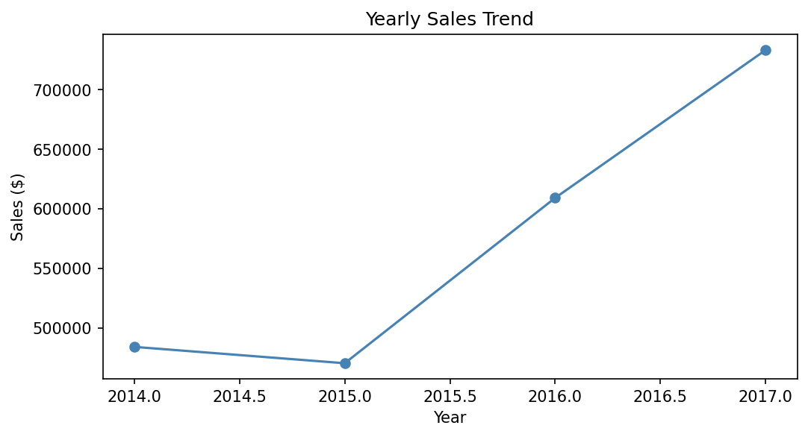
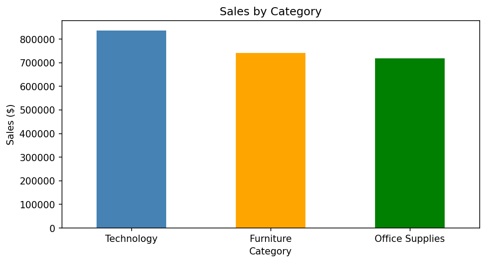
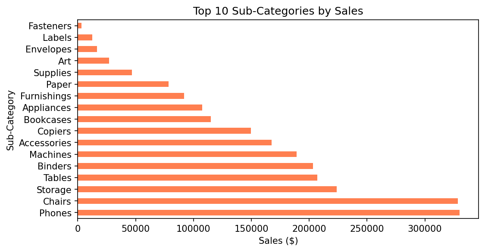
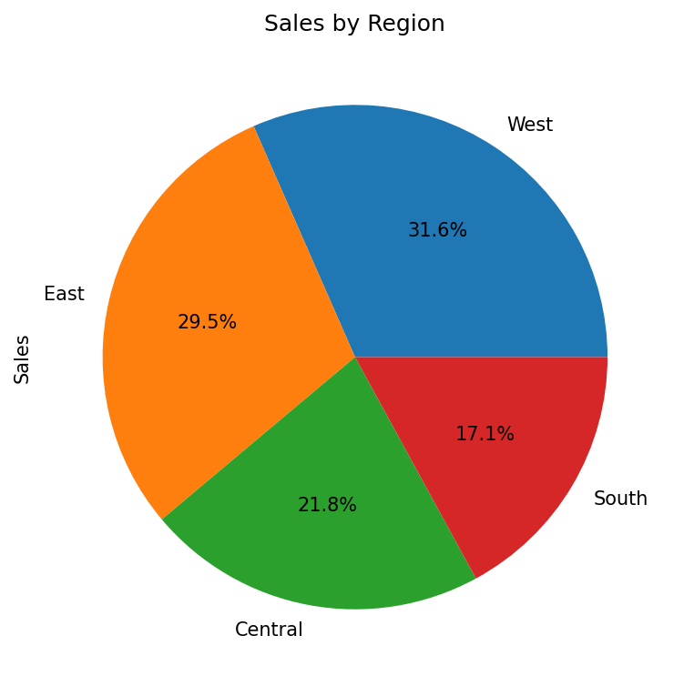
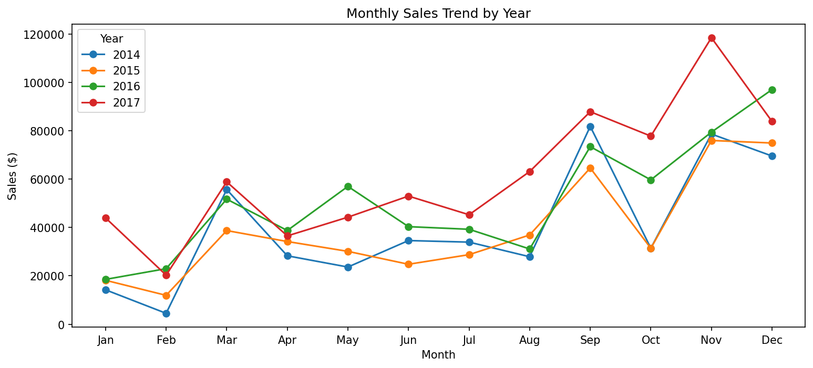
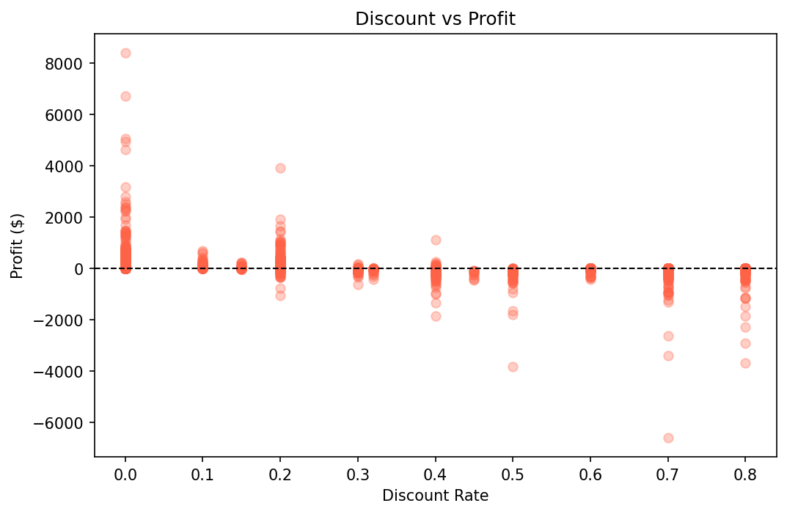
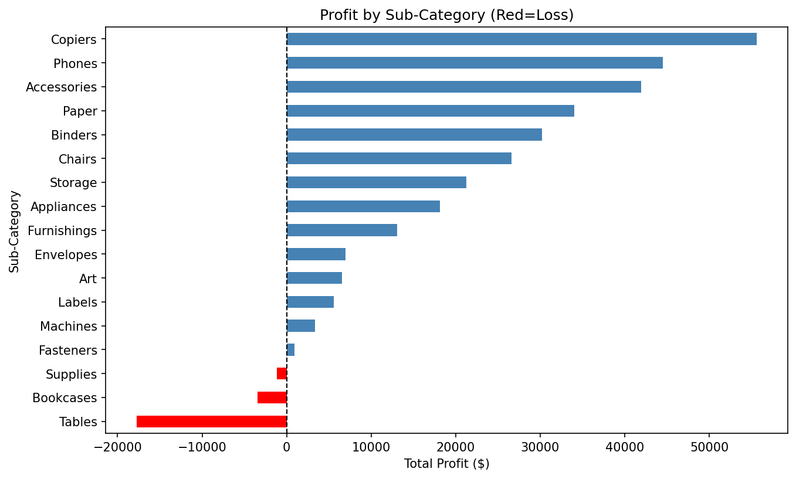

# 📊 Sales Data Analysis Dashboard
> Data Science Project 

A complete exploratory data analysis (EDA) of the Superstore retail dataset (2014–2017), uncovering sales trends, regional performance, product profitability, and the impact of discounting on profit.

---

## 🛠️ Tools & Technologies
- **Python 3.14**
- **Pandas** — data manipulation & analysis
- **Matplotlib** — data visualization
- **Jupyter Notebook**
- **VS Code**

---

## 📁 Project Structure
```
Sales_Dashboard/
├── images/                  # All chart screenshots
├── sales_analysis.ipynb     # Main analysis notebook
├── README.md
└── .gitignore
```

---

## 📈 Visualizations & Insights

### 1. Yearly Sales Trend

> Sales grew from **$484K (2014)** to **$733K (2017)** — a 51% increase over 4 years.

---

### 2. Sales by Category

> **Technology** leads all categories with $836K in total sales.

---

### 3. Top 10 Sub-Categories by Sales

> **Phones ($330K)** and **Chairs ($328K)** are the top two sub-categories.

---

### 4. Sales by Region

> The **West region** dominates with 31.6% of total sales. South is the weakest — a potential growth opportunity.

---

### 5. Monthly Sales Trend (Seasonality)

> Sales spike every **September, November and December** — driven by holiday and back-to-school demand.

---

### 6. Discount vs Profit

> Orders with **discounts above 40%** almost always result in losses. Heavy discounting is hurting profitability.

---

### 7. Profit by Sub-Category

> **Tables, Bookcases and Supplies** are loss-making despite high sales volume — directly linked to excessive discounting.

---

## 💡 Key Takeaways 
- 📈 Revenue grew 51% from 2014 to 2017
- 🏆 Technology is the highest revenue category
- 🌍 West region drives the most sales
- ⚠️ Discounts above 40% consistently produce negative profit
- 🔴 Tables and Bookcases need pricing strategy revision

---

## 🚀 How to Run
1. Clone this repo
2. Download the [Superstore Dataset](https://www.kaggle.com/datasets/vivek468/superstore-dataset-final) and place it in the project folder
3. Open `sales_analysis.ipynb` in Jupyter Notebook
4. Run all cells

---

## 👩‍💻 Author
**Adrija Chakraborty**  
📧 [06adrija@gmail.com](mailto:06adrija@gmail.com)
